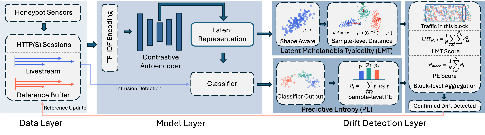

## LANTERN: Diagnosing Web Intrusion Drift under Evolving Attackers

LANTERN is an adaptive drift monitoring framework for web intrusion detection. It integrates large-scale honeypot traffic, representation learning, and a dual-channel drift design built on Latent Mahalanobis Typicality(LMT) and Predictive Entropy(PE). These indicators capture latent structural deformation and decision-level confusion, exposing behavioral evolution in HTTP(S) attacks. The system provides stable long-term monitoring, reveals operational shifts in intrusion activity and supports reliable evaluation of deployed classifiers under changing traffic conditions.



### Conda Environment
To reproduce the exact environment used in this project, use the conda environment:
```
conda lantern create -f environment.yml
conda activate lantern
```

## Key Features
- **Data layer** collects continuous HTTP(S) traffic from global honeypot sensors and maintains both livestream and reference buffers.
- **Model layer** encodes requests with TFIDF and produces latent representations through a contrastive autoencoder, supporting the classifier and capturing evolving malicious structure.
- **Drift detection** layer applies LMT from latent representations and PE from classifier outputs, complemented by statistical detectors, and drives adaptive retraining when persistent drift emerges.

## Project Structure
```
LANTERN/
├── system/                       # main LANTERN modules
│   ├── lantern.py                # full LANTERN pipeline
│   └──  generalization.py        # generalization test: integration with another data stream
│
├── utils/                        # shared utilities for data, drift and models
│   ├── DataUtils.py              
│   ├── DriftUtils.py             # LMT, PE and statistical drift indicators
│   └── ModelUtils.py             
======================= ↑ Core Components of LANTERN ============================================
├── DataLayer/                    # data access, queries and preprocessing
│   ├── datapro.ipynb            
│   ├── query.py                 
│   └── seq.py                    # sequence loader and block generator
│
├── SOTA/                         # comparison with existing drift detection methods
│   ├── utils/                    
│   └── main.py                   # unified baseline evaluation
│
├── data/                         # raw traffic sequences and processed blocks
```

## Baseline Resources
- (Baseline) CADE: https://github.com/whyisyoung/CADE
- (Baseline) OWAD: https://github.com/dongtsi/OWAD
- (Baseline) Mateen: http://github.com/ICL-ml4csec/Mateen
- (Baseline) Chen: https://github.com/wagner-group/active-learning
## Acknowledgement
