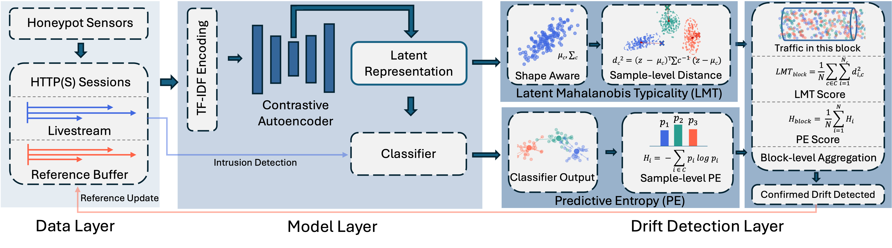

## LANTERN: Diagnosing Drift in Web Intrusion Detection   
LANTERN is an adaptive drift monitoring framework for web intrusion detection. It integrates large-scale honeypot traffic, representation learning, and a dual-channel drift design built on Latent Mahalanobis Typicality(LMT) and Predictive Entropy(PE). These indicators capture latent structural deformation and decision-level confusion, exposing behavioral evolution in HTTP(S) attacks. The system provides stable long-term monitoring, reveals operational shifts in intrusion activity and supports reliable evaluation of deployed classifiers under changing traffic conditions.



### Conda Environment
To reproduce the exact environment used in this project, use the conda environment:
```
conda lantern create -f environment.yml
conda activate lantern
```

## Key Features
- **Data layer** collects continuous HTTP(S) traffic from global honeypot sensors and maintains both livestream and reference buffers.
- **Model layer** encodes requests and produces latent representations through a contrastive autoencoder, supporting the classifier and capturing evolving malicious structure.
- **Drift detection** layer applies LMT from latent representations and PE from classifier outputs, complemented by statistical detectors, and drives adaptive retraining when persistent drift emerges.

## Project Structure
```
LANTERN/
├── system/                       # main LANTERN modules  
│   ├── main.py                   # full LANTERN pipeline, add "--static" arg to run in static mode
│   └──  generalization.py        # generalization test: integration with another data stream
│
├── utils/                     
│   ├── DataUtils.py              
│   ├── DriftUtils.py             # LMT, PE and statistical drift indicators
│   └── ModelUtils.py             
======================= ↑ Core Components of LANTERN ============================================
├── comparison/                         # comparison with existing drift detection methods   
│   ├── utils/                        
│   ├── stage.py                        # Progressive stage-based drift evaluation on public dataset
│   └── stream.py                       # Streaming drift evaluation
├── demo/                               # Reproducible demonstrations and analysis
│   ├── toy_demo.ipynb                  # Toy example illustrating drift signals and intuition     
│   ├── stage_analysis.ipynb            # Step-by-step reproduction of stage-based experiments         
│   ├── stream_static_analysis.ipynb   
│   └── stream_adaptive_analysis.ipynb 
├── supplement/                    # data access, queries, preprocessing, window sensitivity, periodic update
│   ├── dataplot.ipynb            
│   ├── query.py                 
│   ├── seq.py                     # ↑ data
│   ├── win_sensitivity.py        
│   └── periodic.py             
│
├── data/                          # raw traffic sequences and processed blocks
```

## Toy Example  
LANTERN involves multiple components including representation learning, statistical calibration, and drift monitoring over time. While the full system operates on large scale traffic streams, the underlying principle is straightforward: detect when the model becomes misaligned with incoming data. 
To make this intuitive, we provide a [toy example](demo/toy_demo.ipynb) that demonstrates the core idea in a simplified setting.

## Baseline Resources
- (Baseline) CADE: https://github.com/whyisyoung/CADE
- (Baseline) Chen: https://github.com/wagner-group/active-learning
- (Baseline) ENIDrift: https://github.com/X1anWang/ENIDrift
- (Dataset)  CICIoT2023: https://www.unb.ca/cic/datasets/iotdataset-2023.html
- (Dataset)  Android Malware 2017: https://www.unb.ca/cic/datasets/andmal2017.html
- The primary dataset used in this paper is collected from a large scale operational honeypot deployment and is processed in situ through controlled interfaces. Due to sensitivity and operational constraints, this dataset is not publicly available at this stage.
  
## Acknowledgement   
This project is supported through academic and industry collaborations enabling large scale measurement and analysis of real world web traffic.
